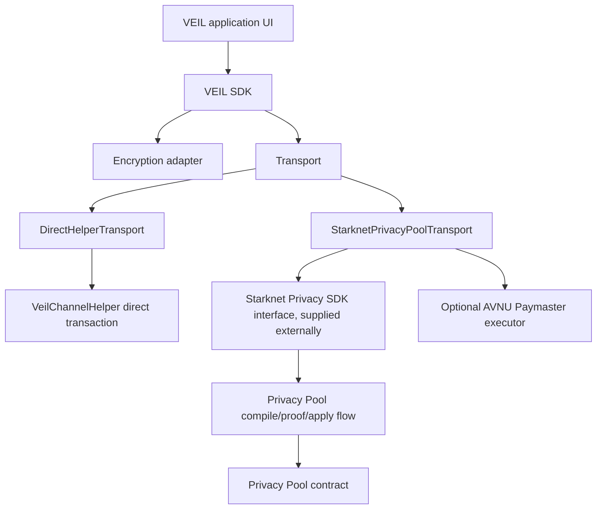

# VEIL Current Developer Status

VEIL is an application layer for encrypted negotiation, messaging, payment memo, and escrow workflows on Starknet. The project is designed to integrate with STRK20 Privacy Pool, but the repository does not include the private official Starknet Privacy SDK or prover implementation.

This document describes the current codebase. It does not claim that Shield mode is finished.

## Current Architecture



## Implemented

- VEIL SDK public client methods for channels, messages, offers, payment memos, proof references, timeline reads, fee discovery, fee estimation, and session lifecycle.
- Direct helper unshield path through `DirectHelperTransport`.
- Direct helper transaction submission through a supplied Starknet account.
- Receipt waiting and timeline synchronization for direct helper transactions.
- Ciphertext-only timeline reads; indexer/helper reads do not decrypt payloads.
- AES-GCM payload encryption when a key or Privacy Pool-derived secret material is supplied.
- Fail-closed browser ECDH compatibility exports; VEIL does not generate production browser ECDH keys.
- Privacy Pool ClientAction serialization helpers for the canonical action variants used by the reference contract.
- Fee discovery from `get_fee_amount()` and `get_fee_collector()`.
- A `StarknetPrivacyPoolTransport` integration boundary that can call an externally supplied SDK interface.

## Partially Implemented

- Shield transport orchestration is prepared. It can pass ClientActions to an injected `privacySdk` object and expects that object to compile actions, generate proofs, and build or execute an `apply_actions` transaction.
- Channel and subchannel action preparation exists, but production channel key recovery and official Stark-curve cryptographic operations are not implemented in this repository.
- Fee estimation supports Privacy Pool and direct-helper transaction types. The Privacy Pool contract fee is STRK as defined by the reference contract.

## Pending Official Starknet Privacy SDK

The repository does not implement:

- official proof generation,
- official Privacy Pool private key recovery,
- official Stark-curve ECDH,
- Poseidon hash primitive implementations,
- Privacy Pool note encryption/decryption,
- production `apply_actions()` transaction construction without an external SDK,
- production Shield transaction execution without an external SDK/prover.

## Transport Modes

| Mode | Status | Notes |
| --- | --- | --- |
| `mock` | Local development only | In-memory adapter. Not a privacy protocol. |
| `direct-helper` / unshield | Implemented | Writes encrypted timeline references directly through `VeilChannelHelper`. Does not provide Privacy Pool anonymity. |
| `privacy-pool` / shield | Integration point prepared | Requires official Starknet Privacy SDK or equivalent private integration supplied by the application. |

## Security Notes

- Plaintext should remain client-side. The SDK transports ciphertext references and metadata only.
- Session keys authorize application-layer actions only. They are not wallet keys, encryption keys, or financial authorization keys.
- Direct helper mode provides onchain availability and ordering for encrypted references, not sender/recipient privacy.
- Shield mode must fail closed when the official SDK/prover integration is absent.

## Validation Commands

```bash
npm run test:sdk
npm run typecheck
```

## Reference Contract Boundary

The canonical STRK20 Privacy Pool source is local under `reference/contracts`. It is treated as read-only protocol reference material and must not be copied into the VEIL source tree.
