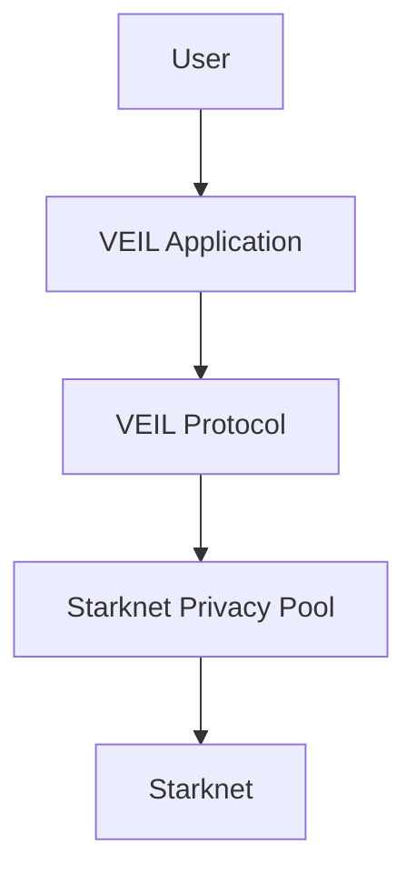

# VEIL

VEIL is a private communication, negotiation, payment memo, and escrow platform built on Starknet Privacy Pool.

It gives users a Deal Room where they can coordinate sensitive payments, offers, memos, proofs, and escrow milestones without turning the public chain into the product conversation.

## 1. What Is VEIL?

VEIL is a product for private deal coordination on Starknet.

Users open private channels, exchange encrypted messages, attach payment memos, negotiate offers, track escrow milestones, and choose whether an action should use Shield or Unshield mode.

Everything else in this repository exists to support that product experience.

## 2. What Problem Does VEIL Solve?

Onchain payments and settlement are transparent, but real deals often need context that should not be public by default:

- who is negotiating with whom,
- what a payment is for,
- what terms were proposed,
- which proofs or references support the deal,
- whether escrow is waiting, active, released, or cancelled.

Without VEIL, teams either leak sensitive metadata onchain or move the discussion into disconnected offchain tools. VEIL keeps the deal workflow together while reducing metadata exposure.

## 3. Why Privacy Pool Is Important

Starknet Privacy Pool gives VEIL a privacy-preserving foundation for shielded actions and metadata-resistant communication.

For the STRK20 Privacy Pool RFP, the product value is encrypted onchain messaging, private payment memos, escrow negotiation, and deal coordination that can use Privacy Pool as the privacy layer.

## 4. What Can Users Do With VEIL?

- Create private deal channels.
- Send encrypted messages inside a Deal Room.
- Prepare and sign payment memos.
- Negotiate offers, counter-offers, acceptances, and rejections.
- Track escrow states from creation through release or cancellation.
- Attach proof references to a channel.
- Choose Shield mode for privacy-preserving flows when available.
- Choose Unshield mode for explicit public/testnet flows.
- Review wallet status, channel activity, and privacy settings.

## 5. Main Features

- **Deal Room:** one place for messages, offers, payment context, proofs, and escrow state.
- **Private Messaging:** encrypted channel communication for sensitive deal context.
- **Payment Memo:** structured payment notes tied to a deal channel.
- **Escrow Workflow:** buyer/seller milestones for deposits, activation, release, and cancellation.
- **Negotiation:** offers, counter-offers, acceptance, rejection, and channel history.
- **Shield / Unshield Modes:** clear user-facing privacy choices before sensitive actions.
- **Wallet:** Starknet wallet connection, account status, and asset readiness.
- **Activity:** pending actions and history across channels.
- **Settings:** privacy defaults, memo requirements, notifications, and account controls.

## 6. Product Architecture



At a high level, VEIL is the product surface users interact with. The VEIL Protocol coordinates private deal metadata. Privacy Pool provides the privacy layer for shielded flows. Starknet provides settlement and availability.

## 7. Current Status

VEIL is an active product prototype with implemented application flows for channels, messages, payment memos, negotiation, wallet status, activity, settings, and escrow workflow state.

Current implementation status:

- Product UI and Deal Room workflows are present.
- Unshield testnet messaging through the VEIL helper path is implemented.
- Encrypted timeline references are supported.
- Escrow workflow contracts exist for application-layer deal state.
- Shield mode is prepared as an integration boundary.
- Production Shield execution requires the official Starknet Privacy SDK/prover or an equivalent Privacy Pool integration.

VEIL does not claim production Privacy Pool proof generation inside this repository.

## 8. Quick Start

```bash
npm install
cp .env.example .env.local
npm run dev
```

Then open the local Vite URL printed by the dev server.

For local review, use mock or direct-helper configuration. Full Shield mode requires a real Privacy Pool integration.

## 9. Documentation Index

Start with the product documents before reading implementation details.

- [Product](docs/product/README.md): vision, problem, solution, features, use cases, user journey, screenshots, FAQ, and roadmap.
- [Product Guides](docs/guides/README.md): user behavior for messaging, payment memo, escrow, negotiation, Shield, Unshield, wallet, channels, activity, and settings.
- [Architecture](docs/architecture/README.md): high-level product architecture only.
- [Technical Documentation](docs/technical/README.md): SDK, transport, encryption, session keys, contracts, Privacy Pool integration, helper contract, indexer, and research references.

## License

Apache-2.0. Copyright 2026 DXJlabs.
