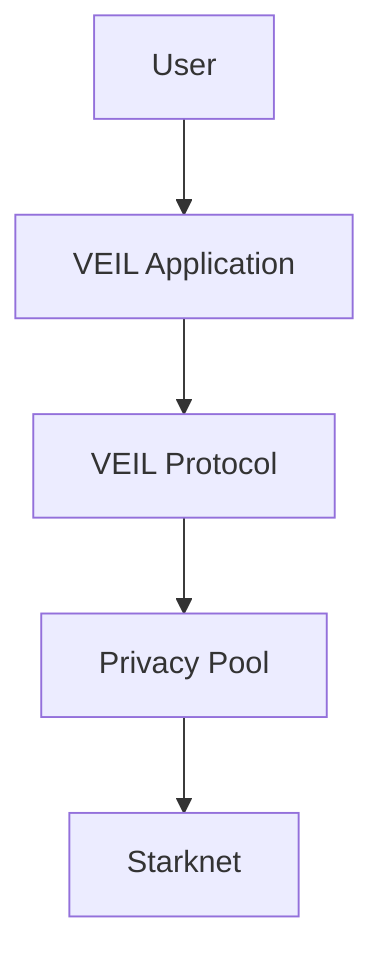

# Architecture

This section describes VEIL at a high level only.

Low-level cryptography, ABI notes, SDK APIs, transports, helper contract details, source analysis, and research notes belong in [Technical Documentation](../technical/README.md).

## Product Architecture

## Layers

| Layer | Product role |
| --- | --- |
| User | Opens channels, sends messages, negotiates, creates memos, coordinates escrow, and reviews activity. |
| VEIL Application | The user-facing Deal Room, wallet, activity, payment, escrow, and settings experience. |
| VEIL Protocol | The application protocol that organizes private deal metadata and channel activity. |
| Privacy Pool | The privacy layer for Shield mode and metadata-resistant communication. |
| Starknet | The settlement and availability layer. |

## Product Subsystems

- Deal Channel.
- Messaging.
- Payment Memo.
- Negotiation.
- Escrow.
- Shield / Unshield privacy choice.
- Wallet.
- Activity.
- Settings.

## What This Section Excludes

- SDK API tables.
- Transport implementation.
- ABI analysis.
- Cryptographic primitives.
- Contract entrypoints.
- Source-code analysis.
- Indexer internals.

Those details are available only after the product and architecture context in [Technical Documentation](../technical/README.md).
