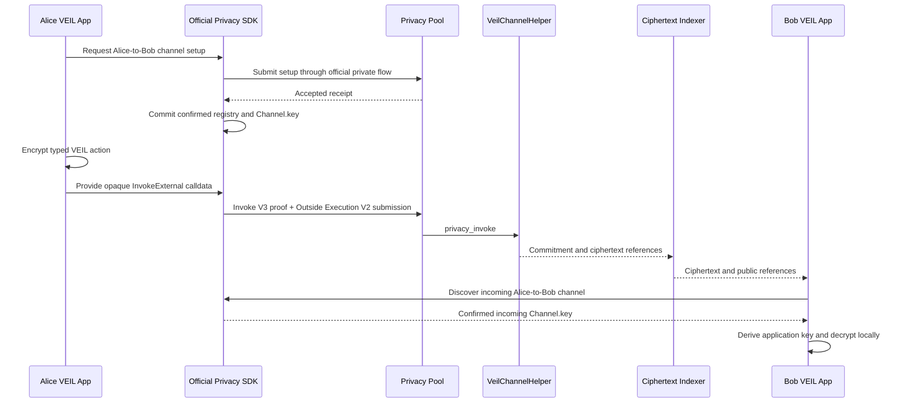
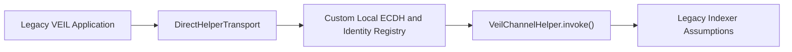

# Architecture

This document is the single high-level architecture reference for VEIL.

VEIL is a private Deal Room application built on Starknet. It connects encrypted communication, structured negotiation, private payment context, and escrow coordination through the official Starknet Privacy SDK and Starknet Privacy Pool.

This page describes:

- the complete system architecture;
- the private action lifecycle;
- component responsibilities;
- public and private trust boundaries;
- the ciphertext discovery model;
- Wallet and Unshield separation;
- the difference between the final architecture and the Legacy direct-helper path.

Low-level SDK APIs, cryptographic parameters, Cairo storage layouts, contract ABI details, prover configuration, deployment commands, and source-level analysis belong in the [Technical Documentation](../technical/README.md).

> **Current status:** Pre-production / in development.
>
> The architecture below is the final target architecture. Existing components do not yet prove that the complete real Starknet Sepolia end-to-end flow has passed.

---

# Full System Architecture

```mermaid
flowchart LR

    subgraph Product["VEIL Product Layer"]
        Home["Home and Onboarding"]
        Rooms["Deal Room List"]
        Invite["Counterparty Search and Invitation"]
        Chat["Private Messaging"]
        Offer["Offer and Counter-Offer"]
        Memo["Private Payment Memo"]
        Escrow["Private Escrow Coordination"]
        Activity["Deal Activity"]
        Wallet["Wallet"]
        Settings["Settings"]

        Home --> Rooms
        Rooms --> Invite
        Rooms --> Chat
        Rooms --> Offer
        Rooms --> Memo
        Rooms --> Escrow
        Rooms --> Activity
        Rooms --> Wallet
        Rooms --> Settings
    end

    subgraph AliceDevice["Alice Device — Private Boundary"]
        AliceUI["Alice VEIL Application"]

        TypedAction["Typed VEIL Action
        message
        offer
        counter-offer
        accept / reject
        payment memo
        escrow coordination
        delivery reference"]

        AlicePrivacy["Alice Local Privacy Runtime"]

        OfficialSDK["Official Starknet Privacy SDK
        viewing-key lifecycle
        privacy identity
        channel setup
        channel discovery
        registry
        action compilation"]

        ChannelKey["Confirmed Canonical
        Directional Channel.key"]

        Envelope["VEIL Private Envelope
        domain-separated HKDF
        authenticated encryption
        opaque action type and payload"]

        AlicePrivateState["Alice Local Private State
        viewing key
        private registry
        channel state
        application keys"]

        AliceUI --> TypedAction
        TypedAction --> Envelope
        AliceUI --> AlicePrivacy
        AlicePrivacy --> OfficialSDK
        AlicePrivateState <--> OfficialSDK
        OfficialSDK --> ChannelKey
        ChannelKey --> Envelope
        Envelope -->|"Opaque InvokeExternal calldata"| OfficialSDK
    end

    subgraph ProofSubmission["Proof and Submission Layer"]
        ProofInvocation["Synthetic Proof Invocation
        Invoke Transaction V3"]

        Prover["Official Proof Provider /
        Transaction Prover"]

        CallAndProof["callAndProof
        call
        proofFacts
        proof"]

        OutsideExecution["SNIP-9 Authorization
        OutsideExecutionVersion.V2"]

        Relayer["Relayer"]

        OfficialSDK --> ProofInvocation
        ProofInvocation --> Prover
        Prover --> CallAndProof
        CallAndProof --> OutsideExecution
        OutsideExecution --> Relayer
    end

    subgraph StarknetLayer["Starknet Execution Layer"]
        UserAccount["Supported Starknet Account
        executeFromOutside"]

        PrivacyPool["Starknet Privacy Pool
        apply_actions"]

        InvokeExternal["InvokeExternal
        target: VeilChannelHelper"]

        Helper["VeilChannelHelper
        privacy_invoke"]

        Validation["Helper Validation
        configured Pool caller
        calldata validation
        commitment validation
        replay protection"]

        Storage["VEIL Onchain Ciphertext Storage
        opaque conversation tag
        payload commitment
        event identifier
        ciphertext chunks"]

        Events["Minimal Public Events
        commitment
        opaque references
        transaction context"]

        PublicWallet["Public Starknet Wallet Balance"]

        Relayer --> UserAccount
        UserAccount --> PrivacyPool
        PrivacyPool --> InvokeExternal
        InvokeExternal -->|"Fixed privacy_invoke entrypoint"| Helper
        Helper --> Validation
        Validation --> Storage
        Validation --> Events
        PrivacyPool -->|"Unshield withdrawal only"| PublicWallet
    end

    subgraph PublicDiscovery["Public Discovery Boundary"]
        Indexer["VEIL Ciphertext-Only Indexer"]

        IndexedData["Indexed Public Data
        contract address
        block number
        transaction hash
        event identifier
        opaque conversation reference
        payload commitment
        ciphertext location"]

        Storage --> Indexer
        Events --> Indexer
        Indexer --> IndexedData
    end

    subgraph BobDevice["Bob Device — Private Boundary"]
        BobUI["Bob VEIL Application"]

        BobPrivacy["Bob Local Privacy Runtime"]

        BobSDK["Official Starknet Privacy SDK
        incoming-channel discovery
        registry recovery"]

        BobPrivateState["Bob Local Private State
        viewing key
        private registry
        channel state
        application keys"]

        BobChannelKey["Confirmed Incoming
        Directional Channel.key"]

        BobEnvelope["VEIL Envelope Reconstruction
        ciphertext verification
        application-key derivation
        authenticated decryption"]

        DecryptedAction["Decrypted Typed VEIL Action"]

        IndexedData --> BobPrivacy
        BobPrivacy --> BobSDK
        BobPrivateState <--> BobSDK
        BobSDK --> BobChannelKey
        BobChannelKey --> BobEnvelope
        IndexedData --> BobEnvelope
        BobEnvelope --> DecryptedAction
        DecryptedAction --> BobUI
    end

    Product --> AliceUI
    BobUI --> Product

    Legacy["Legacy Path
    DirectHelperTransport
    helper.invoke()
    custom local ECDH
    old indexer assumptions"]

    AliceUI -. "No automatic fallback" .-> Legacy
```



---

# Diagram Summary

The system is divided into five main boundaries:

1. **VEIL Product Layer**  
   The interface used for Deal Rooms, messaging, offers, payment memos, escrow, activity, Wallet, and settings.

2. **Participant Local Privacy Runtime**  
   The private environment on Alice’s or Bob’s device. Viewing keys, channel keys, application keys, private registry state, and decrypted content remain here.

3. **Proof and Submission Layer**  
   The official proof invocation, prover, Outside Execution V2 authorization, and relayer submission path.

4. **Starknet Execution Layer**  
   The user account, Privacy Pool, `VeilChannelHelper`, public events, and ciphertext storage.

5. **Public Discovery Boundary**  
   The ciphertext-only indexer, which locates encrypted records without receiving private keys or plaintext.

---

# Core Architecture Rules

## Private by Default

All Deal Room communication and coordination uses the private path.

This includes:

- messages;
- offers;
- counter-offers;
- offer revisions;
- accept actions;
- reject actions;
- payment memos;
- escrow coordination;
- delivery references;
- settlement context.

There is no public or Unshield Deal Room communication mode.

## Local Ownership of Private Material

The following information must remain inside the intended participant’s local runtime:

- viewing key;
- canonical directional `Channel.key`;
- application encryption key;
- private registry;
- decrypted message;
- decrypted offer;
- decrypted payment memo;
- decrypted escrow details.

The public indexer and backend must never request or receive this information.

## Ciphertext-Only Public Infrastructure

Public infrastructure may process:

- ciphertext;
- opaque conversation references;
- payload commitments;
- event identifiers;
- ciphertext storage locations;
- transaction hashes;
- block numbers;
- public timestamps.

It must not understand the private semantic meaning of an encrypted action.

## Official SDK as Source of Truth

The official Starknet Privacy SDK is responsible for:

- viewing-key lifecycle;
- privacy identity;
- privacy public key;
- participant registration when required;
- directional channel setup;
- ECDH wrapping and recovery;
- canonical `Channel.key`;
- incoming and outgoing channel discovery;
- private registry management;
- action compilation;
- proof invocation construction;
- proof-provider interaction.

VEIL must not replace these responsibilities with custom production cryptography.

## VEIL Application Encryption

VEIL receives the confirmed canonical directional `Channel.key` through the official runtime.

VEIL then derives an application-specific key and encrypts the complete typed Deal Room action.

```text
Confirmed official Channel.key
→ domain-separated VEIL HKDF
→ application encryption key
→ authenticated encryption
→ opaque VEIL ciphertext
```

The action type must also remain encrypted.

Public calldata must not reveal whether the encrypted action is:

- a message;
- an offer;
- a payment memo;
- an escrow update.

## No Silent Fallback

When private execution fails, VEIL must stop safely.

It must not:

- use `DirectHelperTransport` automatically;
- call the Legacy direct helper automatically;
- send a public message;
- publish an offer;
- expose a payment memo;
- coordinate escrow publicly;
- display a false success state.

---

# Component Responsibilities

| Component | Responsibility | Must not do |
| --- | --- | --- |
| VEIL Application | Presents Deal Rooms, actions, states, Wallet, and errors | Handle raw private keys or claim success without evidence |
| Local Privacy Runtime | Keeps participant-private state and connects product actions to the official SDK | Send private material to the indexer |
| Official Starknet Privacy SDK | Handles privacy identity, channels, discovery, registry, compilation, and proof preparation | Be replaced by custom production channel logic |
| VEIL Envelope Layer | Derives the application key and encrypts typed Deal Room actions | Expose action type or plaintext publicly |
| Transaction Prover | Produces proof data for the synthetic Invoke V3 invocation | Receive unnecessary application plaintext |
| Outside Execution V2 | Authorizes relayed account submission | Be confused with the Invoke V3 proof version |
| Relayer | Submits the authorized call and proof | Decrypt Deal Room content |
| Starknet Privacy Pool | Processes private actions and invokes the VEIL helper | Be modified by VEIL for application-specific behavior |
| VeilChannelHelper | Validates the Pool caller and stores opaque application ciphertext | Decrypt or interpret private actions |
| Ciphertext-Only Indexer | Locates encrypted records and public references | Receive viewing keys, channel keys, or plaintext |
| Recipient Local Runtime | Discovers the channel and decrypts the VEIL action locally | Send decrypted content back to the public indexer |
| Wallet | Shows account, balances, and withdrawal actions | Provide Unshield communication modes |

---

# Private Action Lifecycle

## 1. Action Creation

Alice creates a typed Deal Room action.

Examples:

```text
message
offer
counter-offer
accept
reject
payment memo
escrow update
delivery reference
```

The action exists as plaintext only inside Alice’s local application boundary before encryption.

## 2. Channel Availability

The official SDK determines whether Alice already has a confirmed outgoing directional channel to Bob.

When no confirmed channel exists, Alice must establish one first.

## 3. Channel Setup

The official SDK prepares the required registration or channel-setup action.

The setup transaction is submitted and VEIL waits for an accepted receipt.

The local canonical registry must not be committed before acceptance.

## 4. Canonical Channel Key

After the setup transaction is accepted, the official SDK refreshes or commits the confirmed registry.

VEIL then receives the confirmed directional `Channel.key`.

The Legacy manually calculated ECDH key must not be used as the production source of truth.

## 5. VEIL Envelope Encryption

VEIL derives an application-specific key using a domain-separated KDF.

The complete action type and payload are encrypted with authenticated encryption.

Encryption must happen once before transaction compilation.

Retries must reuse the same prepared encrypted envelope rather than generating a different payload during recompilation.

## 6. InvokeExternal Compilation

The official SDK compiles an `InvokeExternal` action.

The target is:

```text
VeilChannelHelper
```

The Privacy Pool uses the fixed entrypoint:

```text
privacy_invoke
```

## 7. Proof Invocation

The synthetic proof transaction uses:

```text
Invoke Transaction V3
```

This describes the transaction represented inside the proof.

## 8. Outside Execution Authorization

Relayed account authorization uses:

```text
OutsideExecutionVersion.V2
```

Invoke V3 and Outside Execution V2 are separate version domains.

## 9. Relayed Submission

The relayer submits the authorized transaction through the supported Starknet account.

The submission includes the required call, `proofFacts`, and proof data.

## 10. Privacy Pool Execution

Starknet Privacy Pool processes the private action.

For the VEIL application call, the Pool invokes:

```text
VeilChannelHelper.privacy_invoke
```

## 11. Helper Validation

The helper validates:

- the caller is the configured Privacy Pool;
- the calldata structure is valid;
- the commitment is valid;
- the protected action has not already been stored.

## 12. Ciphertext Storage

The helper stores:

- opaque conversation tag;
- event identifier;
- payload commitment;
- ciphertext chunks;
- required public storage metadata.

The helper does not receive or store:

- viewing key;
- channel key;
- application key;
- plaintext message;
- plaintext offer;
- plaintext memo;
- plaintext escrow terms.

## 13. Public Discovery

The indexer reads public events and storage references.

It returns ciphertext and public references only.

It does not decrypt or classify private application content.

## 14. Recipient Channel Discovery

Bob’s official SDK discovers Bob’s confirmed incoming directional channel from Alice.

Bob obtains the canonical channel key inside his local runtime.

## 15. Local Decryption

Bob’s VEIL runtime:

1. reconstructs the encrypted envelope;
2. derives the VEIL application key;
3. verifies the authenticated ciphertext;
4. decrypts the complete typed action;
5. passes the decrypted action to the VEIL application.

Only then may Bob’s interface display the private content.

---

# First Message Flow

The first message may require two transactions.



The application must not assume that channel setup and the first private message can always be completed in one transaction.

Bob’s first reply may require a separate Bob-to-Alice directional channel.

---

# Product Subsystems

## Deal Rooms

A private workspace for one agreement or counterparty relationship.

## Counterparty Search and Invitation

Allows users to find a participant by a supported Starknet name or address and invite them into the Deal Room.

## Private Messaging

Carries encrypted communication connected to the same deal context.

## Offer Negotiation

Supports:

- offer creation;
- counter-offer;
- revision;
- acceptance;
- rejection;
- expiry.

All negotiation actions are private-only.

## Private Payment Memo

Connects private payment purpose and milestone context to the relevant agreement.

## Escrow Coordination

Carries private coordination related to:

- participant roles;
- deposit readiness;
- activation;
- release conditions;
- completion;
- cancellation.

This does not automatically mean production asset custody is already complete.

## Delivery References

Connects milestone or delivery evidence to the relevant Deal Room.

## Activity

Shows accurate action states across communication, negotiation, memo, escrow, and settlement context.

## Wallet

Shows:

- connected Starknet account;
- network;
- public balance;
- private-balance readiness;
- pending Wallet actions;
- withdrawal controls.

## Settings

Manages:

- sessions;
- notifications;
- account information;
- network information;
- security controls;
- display preferences.

Settings must not provide a public Deal Room communication mode.

---

# Wallet and Unshield Boundary

Unshield is not part of the Deal Room communication architecture.

The term **Unshield** is used only when funds move:

```text
Private Privacy Pool balance
→ public Starknet wallet balance
```

Unshield may create publicly visible wallet activity.

It must not be used for:

- messages;
- offers;
- counter-offers;
- accept or reject actions;
- payment memos;
- escrow coordination;
- delivery references;
- fallback after a private action fails.

---

# Public and Private Boundaries

## Private Participant Data

The following data must remain inside Alice’s or Bob’s private device boundary:

- viewing keys;
- private registry;
- canonical channel keys;
- VEIL application keys;
- plaintext messages;
- plaintext offers;
- plaintext payment memos;
- plaintext escrow coordination;
- decrypted delivery references.

## Public Starknet Data

Depending on the final implementation, public observers may see:

- transaction existence;
- transaction timing;
- contract addresses;
- account interactions;
- Privacy Pool interactions;
- helper interactions;
- transaction hashes;
- block numbers;
- ciphertext length;
- opaque commitments;
- public Wallet activity;
- Unshield withdrawals.

VEIL must not claim that all metadata is hidden.

## Public Indexer Data

The indexer may receive:

- contract address;
- block number;
- transaction hash;
- event identifier;
- opaque conversation reference;
- payload commitment;
- ciphertext location;
- ciphertext chunks;
- public timestamp.

The indexer must never receive:

- viewing keys;
- canonical channel keys;
- application encryption keys;
- private registry;
- plaintext Deal Room content.

---

# Legacy Architecture

VEIL contains an older encrypted direct-helper architecture.



The Legacy path may include:

- `DirectHelperTransport`;
- direct helper `invoke()`;
- locally managed encryption identities;
- custom channel setup;
- manual Stark-curve ECDH;
- older ciphertext-event assumptions;
- Shield/Unshield communication choices.

Its status is:

> **Legacy — historical development evidence, not the final production architecture.**

The Legacy path must not:

- become an automatic fallback;
- be presented as official Privacy Pool execution;
- be documented as the final production channel model;
- be used as proof that private negotiation or escrow is complete.

---

# Architecture Status

| Component | Status |
| --- | --- |
| Deal Room product model | Completed |
| Primary user journeys | Completed |
| Interface foundation | Completed / In Development |
| Legacy direct encrypted messaging | Legacy |
| Official Privacy SDK package integration | In Development |
| Local private-runtime isolation | In Development |
| Official directional channel setup | In Development |
| Official channel discovery | In Development |
| Confirmed canonical `Channel.key` consumption | In Development |
| VEIL HKDF and authenticated application envelope | In Development |
| Invoke Transaction V3 proof path | In Development |
| Outside Execution V2 submission | In Development |
| Privacy Pool to `privacy_invoke` path | Existing boundary, final E2E pending |
| Helper ciphertext storage | Existing component, final E2E pending |
| Helper replay protection | In Development |
| Ciphertext-only indexer | In Development |
| Bob local discovery and decryption | In Development |
| Official local two-party functional E2E | In Development |
| Real Starknet Sepolia two-party E2E | Planned / Required |
| Private offer negotiation | Planned after core runtime verification |
| Private payment memo | Planned after core runtime verification |
| Private escrow coordination | Planned after core runtime verification |
| Production settlement adapters | Planned |
| Independent security review | Planned |
| Mainnet readiness | Planned |

---

# Architecture Acceptance Gate

The architecture must not be called complete until all required conditions pass.

## Participant and Channel

- [ ] Alice and Bob use separate supported Starknet accounts.
- [ ] Alice-to-Bob directional channel setup succeeds.
- [ ] Bob-to-Alice setup succeeds when a reply requires it.
- [ ] Registry state is committed only after an accepted receipt.
- [ ] VEIL uses the confirmed official canonical `Channel.key`.

## Application Encryption

- [ ] VEIL derives a domain-separated application key.
- [ ] Authenticated encryption is used.
- [ ] The complete action type and payload remain encrypted.
- [ ] Encryption occurs once before transaction compilation.
- [ ] Retries reuse stable ciphertext and calldata.
- [ ] Public calldata does not reveal message, offer, memo, or escrow semantics.

## Proof and Submission

- [ ] Proof invocation uses Invoke Transaction V3.
- [ ] Authorization uses `OutsideExecutionVersion.V2`.
- [ ] The relayer submits the required call, `proofFacts`, and proof.
- [ ] VEIL waits for the required accepted receipt.
- [ ] Failed submission state is not committed locally.

## Privacy Pool and Helper

- [ ] Privacy Pool invokes `VeilChannelHelper.privacy_invoke`.
- [ ] The helper verifies the configured Privacy Pool caller.
- [ ] The helper stores valid ciphertext and commitment data.
- [ ] The helper returns the required Privacy Pool response type.
- [ ] Duplicate protected actions are rejected.
- [ ] Unauthorized direct `privacy_invoke` calls are rejected.

## Indexer and Recipient

- [ ] The indexer receives ciphertext and public references only.
- [ ] The indexer receives no viewing key.
- [ ] The indexer receives no channel key.
- [ ] The indexer receives no application key.
- [ ] The indexer receives no plaintext action.
- [ ] Bob discovers the correct incoming channel.
- [ ] Bob reconstructs and decrypts the exact original action locally.

## Product Safety

- [ ] No automatic direct-helper fallback exists.
- [ ] Failed private actions preserve drafts where appropriate.
- [ ] The product does not display false success.
- [ ] Alice and Bob see consistent Deal Room state.
- [ ] Unshield appears only in Wallet withdrawal.
- [ ] Real Starknet Sepolia two-party evidence is documented.

Until these requirements pass, the correct status remains:

> **Pre-production official Starknet Privacy Pool integration under active development.**

---

# What This Document Excludes

This architecture document intentionally excludes:

- full SDK API tables;
- exact source-level SDK interfaces;
- exact HKDF inputs and encoding;
- ciphertext serialization format;
- Cairo storage implementation;
- complete helper ABI;
- prover JSON-RPC methods;
- Docker deployment instructions;
- environment variables;
- deployment scripts;
- raw calldata;
- complete contract tests;
- historical proving reports.

Those details belong in:

- [Technical Documentation](../technical/README.md)
- [Contract Documentation](../contracts/)
- [Product Documentation](../product/README.md)

Product documentation explains what users experience.

This architecture document explains the complete system, component responsibilities, data flow, and trust boundaries.

Technical documentation explains the implementation details and supporting evidence.
