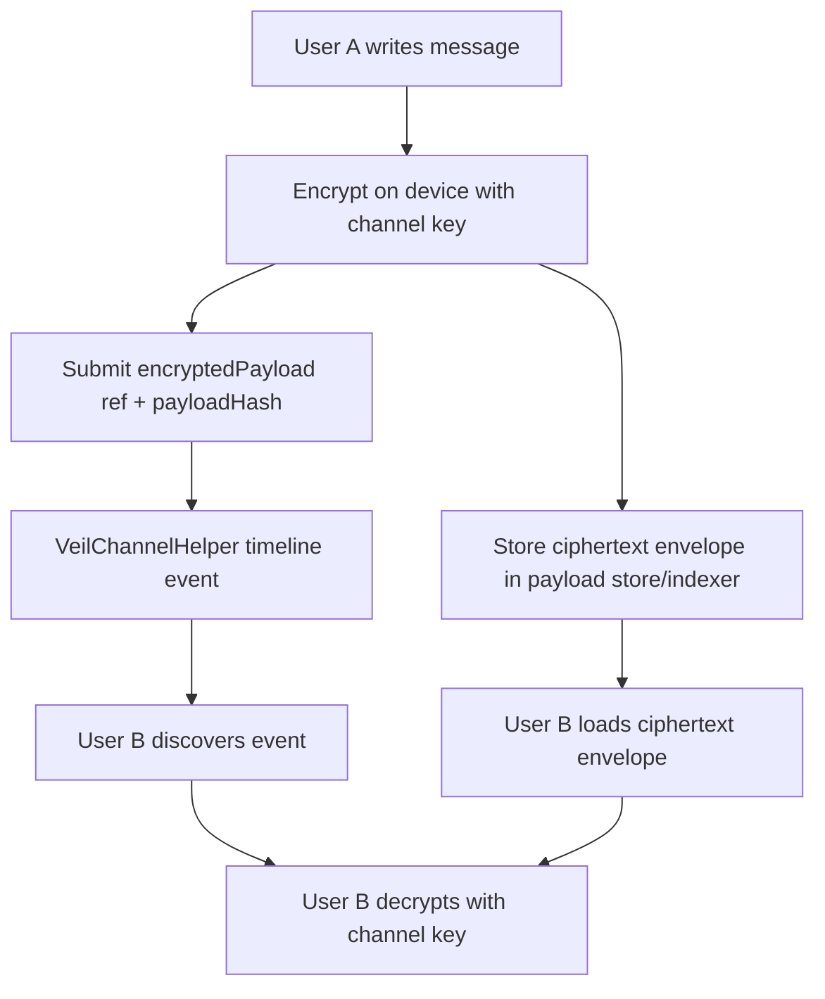
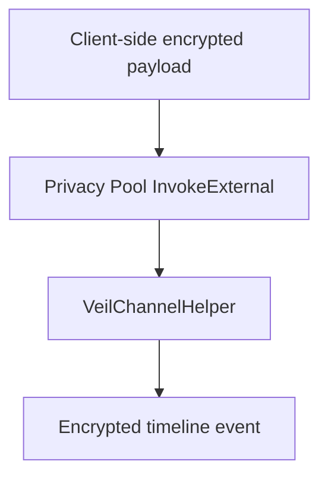

# VEIL Encrypted Channel Privacy

VEIL chat is blockchain-backed, but the readable message body must stay off public chain state.

The current production-safe model is:

Observers can see that a blockchain event exists. They cannot read the message unless they have the channel key and the ciphertext envelope.

## What Is Stored Onchain

`VeilChannelHelper` stores:

- `channel_id`
- `event_type`
- `encrypted_payload`
- `payload_hash`
- `created_at`

For the current helper MVP, `encrypted_payload` is a felt reference to an encrypted payload envelope. It is not plaintext.

## What Is Stored Offchain

`EncryptedPayloadStore` stores:

- ciphertext
- nonce
- payload hash
- key id
- channel/event metadata

The default browser implementation uses IndexedDB for local development. Production apps should replace it with a discovery indexer or encrypted blob service that returns ciphertext envelopes for users who can decrypt them.

## Why Not Store Plaintext Onchain

Public chains are readable by everyone. If chat content is stored as plaintext, it is not private. VEIL therefore stores only encrypted references and commitments onchain.

## Why Not Claim Full Privacy Yet

Direct helper mode does not hide sender metadata. It is useful for Starknet testnet proof because chat events are onchain and transaction hashes are real.

Full privacy path:

When the official Privacy Pool SDK is available, `RealPrivacyPoolAdapter` should supply the channel key derivation and InvokeExternal submission.

## SDK Files

- `packages/veil-sdk/src/channel-encryption.ts`
- `packages/veil-sdk/src/encrypted-payload-store.ts`
- `packages/veil-sdk/src/client.ts`
- `packages/veil-sdk/src/direct_helper_transport.ts`

## Security Notes

- VEIL SDK uses AES-GCM for payload confidentiality and integrity.
- The channel key is injected; VEIL does not invent Privacy Pool ECDH.
- AES-GCM additional authenticated data binds ciphertext to `channelId` and `eventType`.
- Missing ciphertext envelope means the event remains visible but cannot be decrypted.
- Wrong key, wrong channel, wrong event type, or tampered ciphertext fails decryption.

## Interview Explanation

VEIL stores encrypted channel timeline events onchain. The chain proves ordering and availability of event references. Only participants with the channel key can decrypt the ciphertext envelopes. Direct helper mode proves the onchain part now; Privacy Pool mode later hides sender/recipient metadata through `InvokeExternal`.
