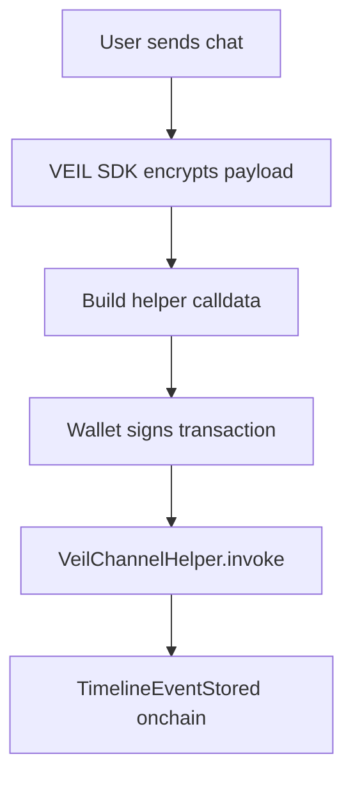
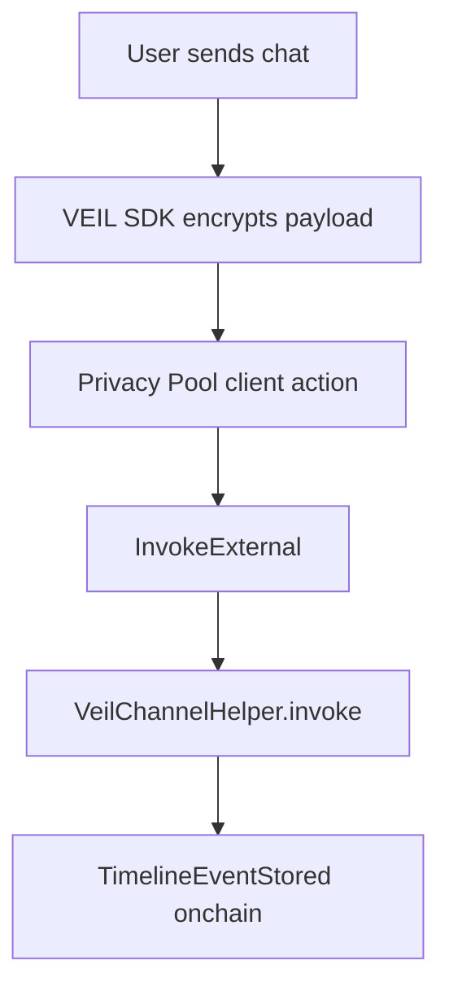

# VEIL Onchain Chat Testnet Mode

VEIL chat is designed to be blockchain-backed.

For the current testnet milestone, VEIL supports a direct `VeilChannelHelper` transport so the app can prove that chat, offer, memo, escrow, and proof timeline events are written onchain.

This is not the final Privacy Pool path. It is the fast, honest testnet path while the official STRK20 Privacy Pool SDK remains private.

## What Is Real Now

- `VeilChannelHelper` stores timeline events onchain by `channel_id`.
- `VeilClient.sendMessage()` creates a chat payload, encrypts it through the configured adapter, and builds helper calldata.
- `DirectHelperTransport` submits a wallet transaction to `VeilChannelHelper.invoke`.
- The transaction returns a Starknet transaction hash.
- The frontend can read `get_event_count` and `get_event` from the helper contract.

## What Is Not Claimed Yet

- This mode does not route through Privacy Pool `InvokeExternal`.
- This mode does not provide sender anonymity.
- This mode does not implement STRK20 private transfer logic.
- This mode does not implement official Privacy Pool ECDH because that SDK is not public yet.

## Why This Exists

The direct helper mode lets VEIL demonstrate real onchain product behavior on Starknet Sepolia now:



When the official Privacy Pool SDK is available, the transport changes:



The core app timeline does not need to change.

## Integration Points

- Helper contract: `src/veil_channel_helper.cairo`
- SDK client: `packages/veil-sdk/src/client.ts`
- Direct testnet transport: `packages/veil-sdk/src/direct_helper_transport.ts`
- Privacy Pool research adapter: `packages/veil-sdk/src/privacy_pool_adapter.ts`
- Testnet example: `examples/veil-onchain-chat-testnet.ts`

## Usage

```ts
import { DirectHelperTransport, VeilClient } from "@dxjlabs/veil-sdk";

const veil = new VeilClient({
  privacyPoolAddress: import.meta.env.VITE_PRIVACY_POOL_ADDRESS,
  helperAddress: import.meta.env.VITE_VEIL_CHANNEL_HELPER_ADDRESS,
  rpcUrl: import.meta.env.VITE_STARKNET_RPC_URL,
  transport: new DirectHelperTransport({
    helperAddress: import.meta.env.VITE_VEIL_CHANNEL_HELPER_ADDRESS,
    account,
    provider,
  }),
});

const sent = await veil.sendMessage({
  channelId: "rights-transfer",
  sender: "you",
  message: "Ready to settle privately.",
});

console.log(sent.transactionHash);
```

## VEIL Implementation Note

VEIL is being built before official Privacy Pool SDK access.

The current implementation deliberately separates:

- `MockPrivacyPoolAdapter`: local product development
- `DirectHelperTransport`: real testnet helper writes
- `ResearchPrivacyPoolAdapter`: read-only Privacy Pool ABI research
- `RealPrivacyPoolAdapter`: future official SDK integration

This keeps VEIL moving without pretending undocumented Privacy Pool transaction flows are complete.
