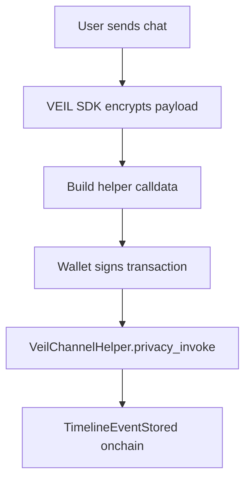
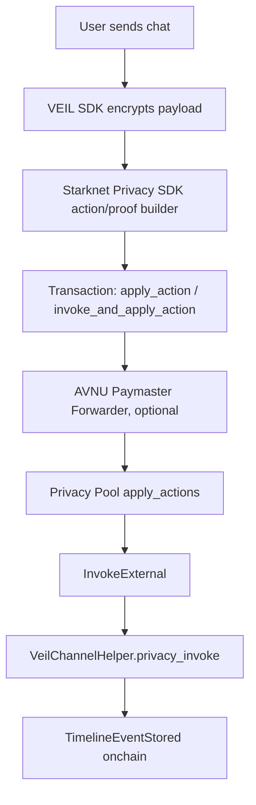

# VEIL Onchain Chat Testnet Mode

VEIL chat is designed to be blockchain-backed.

For the current testnet milestone, VEIL supports a direct `VeilChannelHelper` transport so the app can prove that chat, offer, memo, escrow, and proof timeline events are written onchain.

This is not the Shield Privacy Pool path. It is the fast, honest Unshield testnet path.

## What Is Real Now

- `VeilChannelHelper` stores timeline events onchain by `channel_id`.
- `VeilClient.sendMessage()` creates a chat payload, encrypts it through the configured adapter, and builds helper calldata with an encrypted payload reference.
- `DirectHelperTransport` submits a wallet transaction to `VeilChannelHelper.privacy_invoke`.
- The transaction returns a Starknet transaction hash.
- The frontend can read `get_event_count` and `get_event` from the helper contract.
- `PrivacyPoolChannelEncryptionAdapter` can derive a VEIL message key with HKDF from Privacy Pool-recovered secret material and encrypt payloads with AES-256-GCM so only participants with the canonical Privacy Pool secret can decrypt the ciphertext envelope.

## What Is Not Claimed Yet

- This mode does not route through Privacy Pool `InvokeExternal`.
- This mode does not provide sender anonymity.
- This mode does not implement STRK20 private transfer logic.
- This mode does not implement STRK20 note encryption or Privacy Pool proof generation.
- This mode does not hide sender/receiver metadata.

## Why This Exists

The direct helper mode lets VEIL demonstrate real onchain product behavior on Starknet Sepolia now:



When the official Starknet Privacy SDK integration is wired, the transport changes:



The core app timeline does not need to change.

## Integration Points

- Helper contract: `src/veil_channel_helper.cairo`
- SDK client: `packages/veil-sdk/src/client.ts`
- Direct testnet transport: `packages/veil-sdk/src/direct_helper_transport.ts`
- Starknet Privacy SDK transport boundary: `packages/veil-sdk/src/privacy_pool_adapter.ts`
- AVNU Paymaster execution hook: `packages/veil-sdk/src/privacy_pool_adapter.ts`
- Privacy Pool-derived message encryption: `packages/veil-sdk/src/ecdh.ts`
- Privacy Pool research adapter: `packages/veil-sdk/src/privacy_pool_adapter.ts`
- Channel encryption adapter: `packages/veil-sdk/src/channel-encryption.ts`
- Encrypted payload store: `packages/veil-sdk/src/encrypted-payload-store.ts`
- Testnet example: `examples/veil-onchain-chat-testnet.ts`

## Usage

```ts
import { DirectHelperTransport, VeilClient } from "@dxjlabs/veil-sdk";

const veil = new VeilClient({
  privacyPoolAddress: import.meta.env.VITE_PRIVACY_POOL_ADDRESS,
  helperAddress: import.meta.env.VITE_VEIL_CHANNEL_HELPER_ADDRESS,
  rpcUrl: import.meta.env.VITE_STARKNET_RPC_URL,
  encryption,
  transport: new DirectHelperTransport({
    helperAddress: import.meta.env.VITE_VEIL_CHANNEL_HELPER_ADDRESS,
    account,
    provider,
  }),
});

const sent = await veil.sendMessage({
  channelId: "rights-transfer",
  sender: "you",
  message: "Ready to settle privately.",
  mode: "unshield",
});

console.log(sent.transactionHash);
```

## VEIL Implementation Note

The current implementation deliberately separates:

- `MockPrivacyPoolAdapter`: explicit local product development
- `DirectHelperTransport`: real testnet helper writes
- `StarknetPrivacyPoolTransport`: Shield mode through Starknet Privacy SDK action/proof builders
- `AvnuPrivacyPoolTransport`: deprecated compatibility alias; AVNU remains only the Paymaster/Forwarder layer
- `ResearchPrivacyPoolAdapter`: read-only Privacy Pool ABI research
- `RealPrivacyPoolAdapter`: generic official SDK placeholder

This keeps VEIL moving without pretending undocumented Privacy Pool transaction flows are complete.
