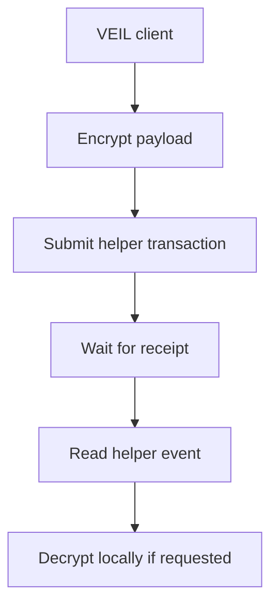

# Testnet Onchain Chat Path

This document describes the implemented testnet path for onchain encrypted chat references.

## Scope

Implemented path:

- `DirectHelperTransport`
- `VeilChannelHelper`
- real Starknet transaction submission
- receipt confirmation
- helper event readback

Not included:

- Privacy Pool proof generation
- Shield anonymity
- private transfers
- official Privacy Pool note handling

## Flow

## What The Helper Stores

The helper stores timeline references:

- channel id felt,
- event type,
- encrypted payload felt,
- payload hash,
- optional payload chunks,
- timestamp.

It does not store plaintext.

## Production Notes

Direct helper mode is useful for testing the product workflow onchain. It should not be described as Privacy Pool Shield mode.

Shield mode requires `StarknetPrivacyPoolTransport` plus an external Starknet Privacy SDK/prover.
