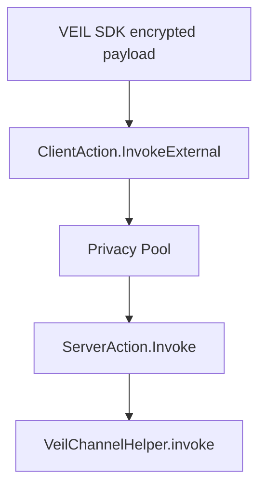

# Privacy Pool ABI Analysis

This note is based on the complete Privacy Pool ABI supplied by the team.

## What The ABI Confirms

The ABI confirms the high-level integration shape VEIL needs:

- Privacy Pool exposes `ClientAction.InvokeExternal`.
- `InvokeExternal` is client action variant `8`.
- `InvokeExternalInput` contains:
  - `contract_address`
  - `calldata: Span<felt252>`
- Server actions include `Invoke`.
- `Invoke` is server action variant `10`.
- `apply_actions(actions: Span<ServerAction>)` is the server execution entrypoint.
- `compile_actions(...)` can compile client actions into server actions.
- Views expose public keys, encrypted private keys, channel info, subchannel info, notes, and nullifiers.
- The README confirms client action phase ordering and places `InvokeExternal` at phase `7`.
- `InvokeExternal` is allowed at most once per transaction.

This means VEIL's helper contract architecture is directionally correct:



## ABI Markers Added To SDK

The SDK now exports:

- `PRIVACY_POOL_CLIENT_ACTIONS`
- `PRIVACY_POOL_CLIENT_ACTION_PHASES`
- `PRIVACY_POOL_SERVER_ACTIONS`
- `PRIVACY_POOL_CLIENT_FUNCTIONS`
- `PRIVACY_POOL_SERVER_FUNCTIONS`
- `PRIVACY_POOL_VIEW_FUNCTIONS`
- `PRIVACY_POOL_ABI_CAPABILITIES`

These are for research, decoding, UI labels, and interview/demo clarity.

## What ABI Enables Now

With ABI alone, VEIL can safely:

- decode Privacy Pool calldata shapes
- identify `OpenChannel`
- identify `OpenSubchannel`
- identify `CreateEncNote`
- identify `UseNote`
- identify `Withdraw`
- identify `InvokeExternal`
- inspect helper invoke payloads
- decode known Privacy Pool event shapes
- build a read-only research page

## What ABI Does Not Give Us

ABI alone does not give:

- ECDH/channel key derivation implementation
- exact note packing/unpacking rules
- exact encryption format for `EncChannelInfo`
- exact encryption format for `EncPrivateKey`
- official SDK transaction construction
- production-safe signing/submission flow
- the source-derived `WriteOnce` replay-protection constraint

So ABI is enough for research and interface planning, but not enough to honestly claim full Privacy Pool SDK integration.

## Important Function Shape

```text
compile_actions(
  user_addr: ContractAddress,
  user_private_key: felt252,
  client_actions: Span<ClientAction>
) -> Span<ServerAction>
```

This confirms the private SDK/source matters because the real app should not invent how `user_private_key`, viewing keys, channel keys, and encrypted notes are derived or managed.

## VEIL Current Status

Current VEIL can prove:

- onchain helper event storage
- encrypted channel payload adapter
- session-key permission gate
- Privacy Pool ABI research decoding

Current VEIL does not yet claim:

- real Privacy Pool sender anonymity
- official ECDH reuse
- production STRK20 SDK submission
- standalone metadata-only message submission through Privacy Pool

## Next Data Needed

To complete production integration, collect:

- testnet Privacy Pool contract address
- helper contract address
- transaction hash for `SetViewingKey`
- transaction hash for `OpenChannel`
- transaction hash for `OpenSubchannel`
- transaction hash for `CreateEncNote`
- transaction hash for `InvokeExternal`
- official SDK/source snippet for channel key derivation
- official replay-protection pattern for message-only `InvokeExternal`

## Source Update

The mainnet source confirms `InvokeExternal` compiles to `ServerAction::Invoke`, but replay protection is only satisfied by `ServerAction::WriteOnce`. See `docs/privacy-pool-source-analysis.md`.

## Interview Explanation

The ABI confirms the exact extension point: `ClientAction.InvokeExternal` routes arbitrary calldata into an external contract through Privacy Pool. VEIL uses that extension point for encrypted timeline events. We have implemented the helper contract, SDK boundaries, encryption adapter, and research decoder. Full Privacy Pool mode waits for official SDK/source so we do not fake private key, viewing key, or ECDH behavior.
