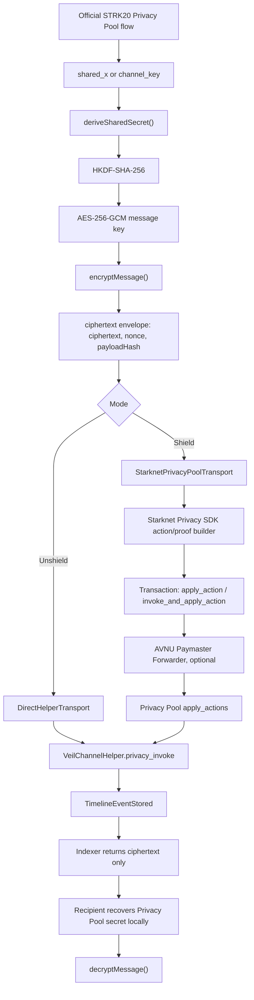

# VEIL Production Onchain Messaging

This document covers the messaging layer only. It does not change authentication, Privy, Google OAuth, wallet onboarding, StarkZap onboarding, escrow, payments, or UI redesign.

## 1. Root Cause Analysis

The previous messaging path could look production-ready while still relying on development defaults:

- `VeilClient` silently defaulted to mock encryption and mock transport.
- Session permissions included escrow-oriented actions.
- Direct helper writes returned local optimistic items that could be displayed as final before indexer confirmation.
- Shield mode was described as future work but had no fail-closed transport boundary.
- The SDK exposed AES channel encryption and a prototype browser ECDH path, but browser ECDH is not STRK20 Privacy Pool-compatible.

The fix is to make production dependencies explicit. Mock mode now requires `allowMock: true`; production clients need a real encryption adapter and a real transport or fail closed.

## 2. Updated Architecture Diagram



## 3. SDK Changes

New production APIs:

- `deriveSharedSecret({ privacyPoolSharedSecret | channelKey })`
- `encryptMessage()`
- `decryptMessage()`
- `PrivacyPoolChannelEncryptionAdapter`
- `sendShieldedMessage()`
- `sendUnshieldedMessage()`
- `decryptTimeline()`
- `watchChannel()`
- `watchMessages()`
- `validateTimelineNonces()`
- `StarknetPrivacyPoolTransport`
- `AvnuPrivacyPoolTransport` compatibility alias

`createSession()`, `destroySession()`, and `restoreSession()` are exposed on `VeilClient` only when a session manager is supplied. Session management remains separate from encryption.

## 4. Smart Contract Integration

`VeilChannelHelper.privacy_invoke(calldata: Span<felt252>)` remains the common helper entrypoint.

Unshield mode calls the helper directly through `DirectHelperTransport`.

Shield mode must call the helper through Privacy Pool using `StarknetPrivacyPoolTransport`. The app supplies a Starknet Privacy SDK action builder that creates the privacy proof and includes the helper call. AVNU Paymaster is optional transaction execution and gas sponsorship infrastructure after the Privacy Pool transaction is built.

Stored helper fields remain:

- `channel_id`
- `event_type`
- `encrypted_payload`
- `payload_hash`
- `payload_chunk_count`
- `created_at`

Payload chunks contain ciphertext envelopes, not plaintext.

## 5. Session Key Flow

Session keys can authorize only:

- chat
- replies
- offers
- counter offers
- payment memos
- negotiation metadata

Current SDK permissions:

- `MESSAGE_SEND`
- `OFFER_CREATE`
- `MEMO_SEND`
- `NEGOTIATION_METADATA`

Session keys do not authorize transfers, escrow release, shield/unshield asset operations, withdrawals, or other financial transactions.

## 6. Privacy Pool Secret Flow

Channel creation stores only:

- channel id
- participants
- Privacy Pool public keys

Private keys and shared secrets are not persisted by the SDK.

Flow:

```text
Official Privacy Pool key recovery
-> shared_x or channel_key
-> HKDF-SHA-256(channel id + VEIL message purpose)
-> AES-256-GCM conversation key
-> encrypted payload envelope
```

AES-GCM associated data binds ciphertext to `channelId` and `eventType`.

## 7. Privacy Pool Flow

VEIL does not create a custom STRK20 note encryption scheme.

For Shield mode, `StarknetPrivacyPoolTransport` requires the app to provide a `buildVeilMessageAction()` implementation backed by the official Starknet Privacy SDK. That builder must construct the `ClientAction`, run the Privacy Pool compile/proof flow, and include the helper call:

```text
VeilChannelHelper.privacy_invoke([channel_id, event_type, encrypted_payload, payload_hash, ...chunks])
```

If the Starknet Privacy SDK builder is missing, Shield mode throws before submission. If an already-built transaction is returned without an `execute()` function, an AVNU Paymaster executor is required to submit it. Shield mode does not fall back to direct helper and does not fake privacy.

Relevant external docs:

- Starknet Privacy overview: https://docs.starknet.io/build/starknet-privacy/overview
- Starknet Privacy architecture: https://docs.starknet.io/build/starknet-privacy/architecture
- Starknet Privacy transaction flow: https://docs.starknet.io/build/starknet-privacy/transaction-flow
- AVNU Paymaster: https://docs.avnu.fi/docs/paymaster

## 8. Indexer Changes

`api/indexer/messages.js` reads helper events and returns ciphertext metadata only:

- tx hash
- block number
- timestamp
- channel id
- encrypted payload
- payload hash
- nonce when present in the ciphertext envelope
- mode
- status
- payload chunks

The indexer does not decrypt and does not store plaintext.

## 9. Frontend Changes

Messaging UI now tracks:

- `encrypting`
- `signing`
- `pending`
- `confirmed`
- `failed`

Each item can display:

- Shield / Unshield badge
- tx hash with Starkscan link
- block number when indexed
- timestamp

Messages added immediately after submission are pending, not confirmed. Confirmed state comes from helper/indexer reads.

## 10. Test Coverage

Added `npm run test:sdk`.

Covered:

- Privacy Pool secret recovery
- HKDF shared key derivation
- AES-GCM encryption
- AES-GCM decryption by recipient
- nonce replay detection
- session creation
- session expiration
- unsupported financial session permissions
- unshield helper transport tx hash
- shield rejected on direct helper transport

Cairo helper tests still cover event storage, event ordering, channel isolation, payload chunks, and invalid calldata.

## 11. Production Readiness Report

Ready now:

- Direct helper unshield path writes encrypted payload references to Starknet with real transactions.
- SDK has production HKDF/AES-GCM payload encryption once canonical Privacy Pool secret material is supplied.
- Session permissions are scoped away from financial actions.
- Mock mode is explicit.
- Frontend no longer treats submitted messages as confirmed before indexer confirmation.

Not complete until Starknet Privacy SDK wiring is supplied:

- Shield mode needs a real Starknet Privacy SDK action builder for private transfer/swap/action proof construction.
- STRK20 note encryption, key agreement, and channel-key recovery must come from Starknet Privacy SDK behavior, not a VEIL-invented protocol.
- Production recipient public-key discovery and official Privacy Pool channel-key recovery need to be wired into channel creation.
- AVNU Paymaster remains an execution/gas-sponsorship dependency only.
