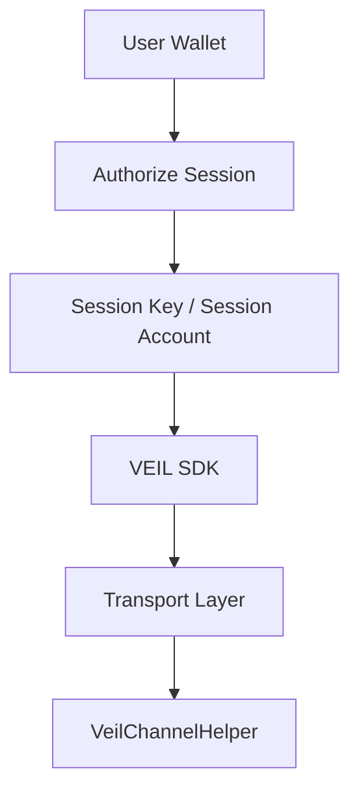
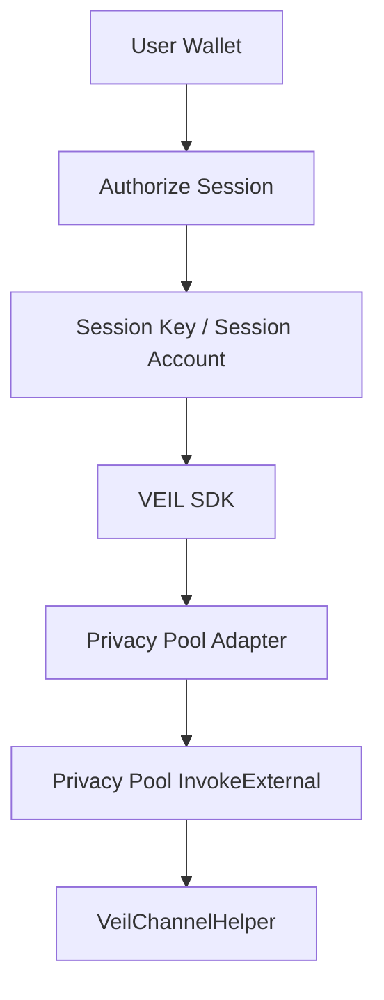

# VEIL Session Key Architecture

VEIL uses session keys so users do not sign every chat message, reply, offer, counter offer, payment memo, or negotiation metadata update with their main wallet.

The main wallet authorizes once. After that, a delegated session account/key can perform scoped VEIL actions until the session expires or is revoked.

## Architecture



Future Privacy Pool path:



The session layer is transport-agnostic. Direct helper mode, mock mode, research mode, and future Privacy Pool mode can all share the same permission checks.

## Files

- `packages/veil-sdk/src/session-key-types.ts`
- `packages/veil-sdk/src/session-key-store.ts`
- `packages/veil-sdk/src/session-key-manager.ts`
- `packages/veil-sdk/src/session-key-hooks.ts`

## Session Shape

```ts
type VeilSession = {
  sessionId: string;
  publicKey: string;
  expiresAt: number;
  createdAt: number;
  permissions: string[];
  channelIds: string[];
};
```

The SDK also tracks optional metadata such as wallet address, chain id, authorization signature, and key handle. It never stores a plaintext private key.

## Permissions

Supported permissions:

- `MESSAGE_SEND`
- `OFFER_CREATE`
- `MEMO_SEND`
- `NEGOTIATION_METADATA`

Session keys never authorize transfers, escrow release, shield/unshield asset operations, withdrawals, or any financial transaction. Those actions must use explicit wallet approval outside the session key path.

## Expiration

Supported presets:

- `1h`
- `12h`
- `24h`
- `7d`

Expired sessions automatically fail and are removed from the active store.

## Storage

`BrowserSessionKeyStore` stores only session metadata in IndexedDB.

Private keys are not persisted by VEIL SDK. A production wallet, Privy session provider, embedded wallet, or account abstraction provider must hold the signer/key material.

For SSR/tests, `MemorySessionKeyStore` is available.

## SDK Integration

```ts
import {
  DirectHelperTransport,
  VeilClient,
  VeilSessionKeyManager,
  BrowserSessionKeyStore,
} from "@dxjlabs/veil-sdk";

const sessionManager = new VeilSessionKeyManager({
  store: new BrowserSessionKeyStore(),
  authorizer: privySessionAuthorizer,
});

await sessionManager.createSession({
  duration: "12h",
  permissions: ["MESSAGE_SEND", "OFFER_CREATE", "MEMO_SEND", "NEGOTIATION_METADATA"],
  channelIds: ["rights-transfer"],
  walletAddress: wallet.address,
  chainId: "SN_SEPOLIA",
});

const veil = new VeilClient({
  privacyPoolAddress,
  helperAddress,
  rpcUrl,
  sessionManager,
  requireSession: true,
  transport: new DirectHelperTransport({
    helperAddress,
    provider,
    sessionAccountResolver: () => privySessionAccount,
  }),
});

await veil.sendMessage({
  channelId: "rights-transfer",
  message: "Ready to settle.",
  sender: "you",
});
```

## React Hooks

```ts
import {
  formatSessionExpiresIn,
  useCreateVeilSession,
  useRefreshVeilSession,
  useRevokeVeilSession,
  useVeilSession,
} from "@dxjlabs/veil-sdk/hooks";

const { data: session } = useVeilSession(sessionManager);
const createSession = useCreateVeilSession(sessionManager);
const revokeSession = useRevokeVeilSession(sessionManager);
const refreshSession = useRefreshVeilSession(sessionManager);

const label = session ? `Session Active · ${formatSessionExpiresIn(session.expiresAt)}` : "Session Inactive";
```

## Security Notes

- Main wallet signs once to authorize a scoped session.
- Session permissions are explicit and individually configurable.
- Session permissions intentionally exclude escrow and financial actions.
- Session channel scope is explicit. Use exact channel ids for production.
- Expired or revoked sessions cannot execute SDK write actions.
- VEIL SDK stores metadata only. It never stores raw private keys.
- Logout should call `sessionManager.clearSession()`.
- Refreshing a session requires an authorizer and should trigger a new wallet authorization.

## Implementation Note

This is designed before public STRK20 Privacy Pool SDK access.

The session architecture intentionally sits above the transport layer:

- Direct helper testnet mode can use session accounts now.
- Mock mode can use the same permission gates.
- Future Privacy Pool mode can reuse the same session manager and replace only transport submission.
