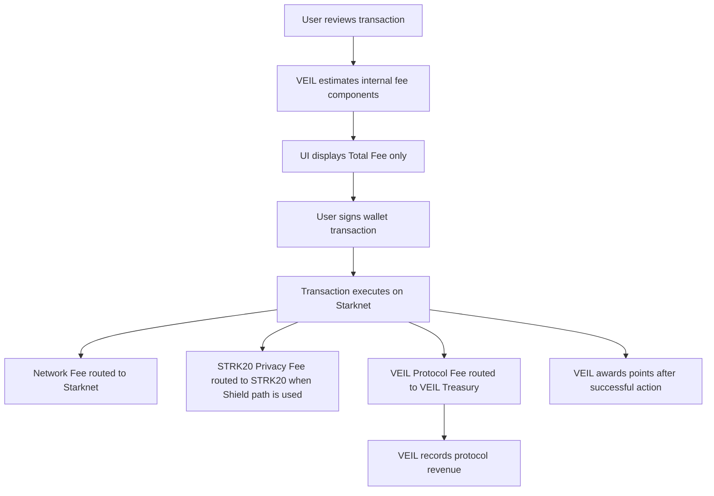
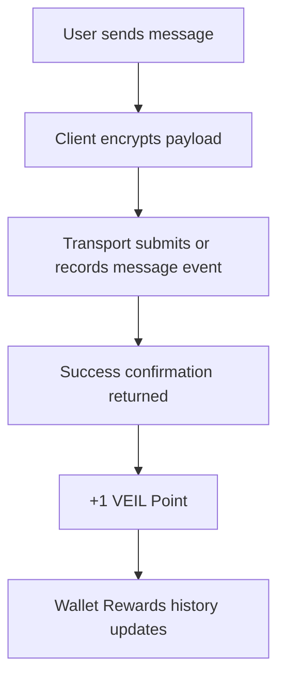
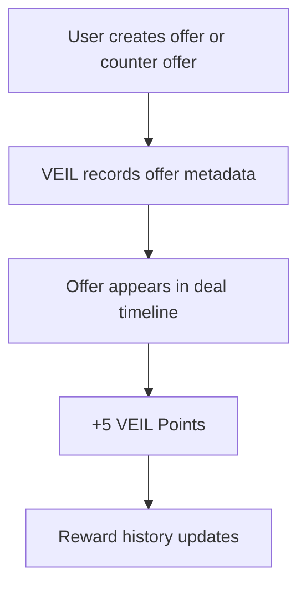
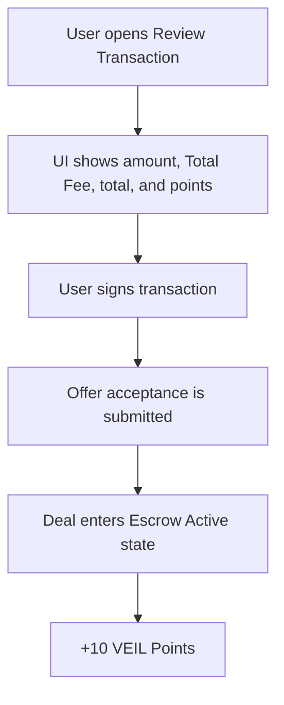
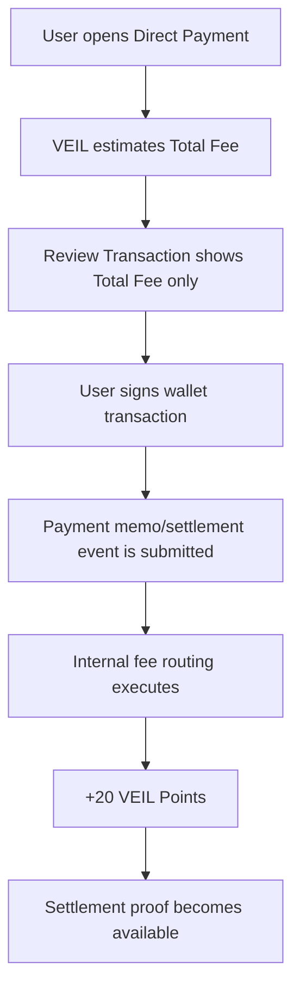
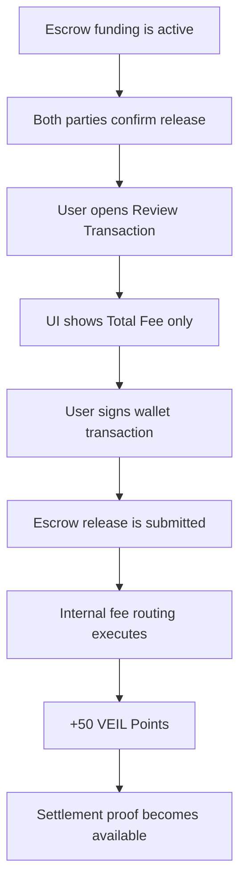
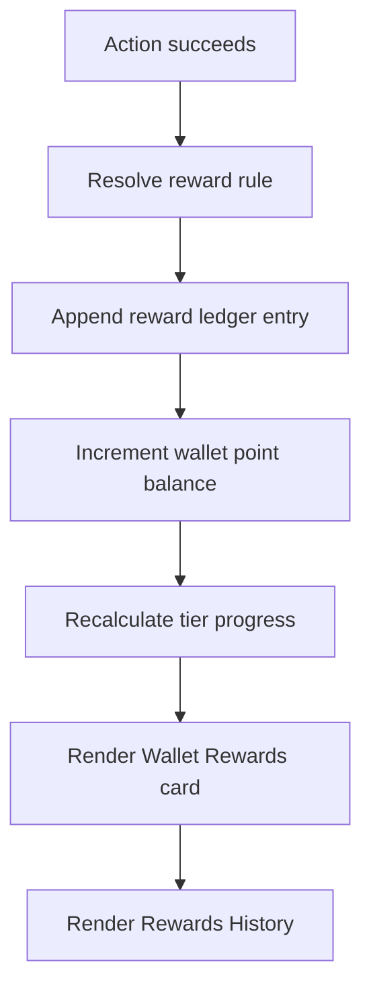

# Fee And Rewards Flow

This document defines the initial VEIL fee and rewards model for Deal, Shielded Chat, Escrow, and Direct Payment flows.

The user interface shows only `Total Fee`. Fee components remain internal accounting and routing details.

## User-Facing Rule

Users see:

- transaction amount,
- `Total Fee`,
- total amount to approve,
- earned VEIL Points.

Users do not see separate Network Fee, STRK20 Privacy Fee, or VEIL Protocol Fee rows in transaction review screens.

## Internal Fee Components

Every paid transaction can have three internal fee components.

| Component | Purpose | Receiver | VEIL Revenue |
| --- | --- | --- | --- |
| Network Fee | Starknet gas for the transaction | Starknet validators/sequencer path | No |
| STRK20 Privacy Fee | Privacy Pool / STRK20 fee when Shield path is used | STRK20 fee collector | No |
| VEIL Protocol Fee | Application protocol fee | VEIL Treasury | Yes |

Only the VEIL Protocol Fee is VEIL revenue.

## Initial Fee Rates

| Flow | Protocol Fee |
| --- | --- |
| Direct Payment | 0.15% |
| Escrow | 0.50% |
| Digital Asset | 0.75% |
| High Value Escrow | 1.00% optional tier |

Initial reference constants:

| Internal component | Reference value |
| --- | --- |
| Network Fee | 0.003 STRK |
| STRK20 Privacy Fee | 0.01 STRK when Shield path is used |

These constants are product estimates. Production execution should use wallet/RPC gas estimation and STRK20 contract fee discovery where available.

## Fee Calculation

For a transaction amount `A` and protocol rate `R`:

```text
protocol_fee = A * R
privacy_fee = STRK20 fee when Shield path is used, otherwise 0
network_fee = estimated Starknet gas fee
total_fee = network_fee + privacy_fee + protocol_fee
total_user_approval = A + total_fee
```

Example for a 500 STRK escrow:

```text
network_fee = 0.003 STRK
privacy_fee = 0.01 STRK
protocol_fee = 500 * 0.50% = 2.5 STRK
total_fee = 2.513 STRK
total_user_approval = 502.513 STRK
```

The UI should show this as:

```text
Amount: 500 STRK
Total Fee: 2.513 STRK
Total: 502.513 STRK
Rewards: +50 VEIL Points
```

## Fee Routing Flow



## Product Flow

### Shielded Chat



Shielded Chat does not have to expose a transaction fee row when the action is not a paid settlement action. If the message path requires an onchain transaction, the UI may show `Total Fee` only.

### Deal / Offer



### Accept Proposal



### Direct Payment



### Escrow



## Rewards Model

VEIL Points are loyalty points. They are not tokens, are not transferable, and are not tradeable.

| Activity | Points |
| --- | ---: |
| Send Message | +1 |
| Create Offer | +5 |
| Counter Offer | +5 |
| Accept Proposal | +10 |
| Direct Payment | +20 |
| Escrow Created | +30 |
| Escrow Completed | +50 |
| Invite User Joined | +100 |

## Rewards Flow



Reward entries should include:

- wallet/account identifier,
- action type,
- points,
- related channel or transaction id when available,
- timestamp,
- idempotency key.

The idempotency key should prevent duplicate rewards if a confirmed transaction is re-indexed.

## Wallet Rewards UI

The Wallet Rewards card shows:

- current VEIL Points,
- next tier,
- points remaining to next tier,
- recent rewards,
- rewards history.

The card should not imply that points are tokens or have a fixed conversion rate.

## Future VEIL Token Path

If a VEIL token is officially launched later, VEIL Points may be used as one input for community distribution rules announced at that time.

Planned allocation can be documented separately from the points ledger:

| Allocation | Share |
| --- | ---: |
| Community | 70% |
| Team | 10% |
| Marketing | 10% |
| Infrastructure | 10% |

If the protocol adopts buyback and burn, only the VEIL Protocol Fee component should be considered for that mechanism. Network Fee and STRK20 Privacy Fee are pass-through costs and should not be counted as VEIL revenue.

## Implementation Notes

- Transaction review screens display aggregate `Total Fee` only.
- Internal accounting keeps component-level fee data for routing and revenue reports.
- SDK fee helpers can expose component-level data to trusted internal callers, but product UI should aggregate it by default.
- Rewards are awarded after successful action confirmation, not when the review modal opens.
- Production implementations should persist rewards server-side or indexer-side, not only in client state.
