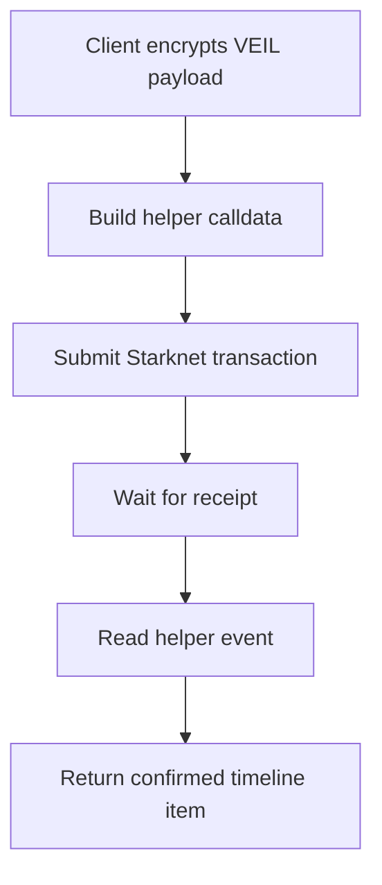
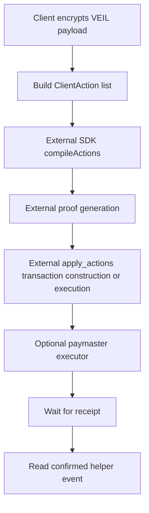

# Onchain Messaging Status

This document describes the current VEIL messaging implementation.

## Implemented: Direct Helper / Unshield

`DirectHelperTransport` is implemented.

Flow:

Current behavior:

- Submits a Starknet transaction through a configured account.
- Calls the helper entrypoint, defaulting to `invoke`.
- Waits for confirmation by default.
- Reads helper event data after confirmation.
- Returns transaction hash, block number when available, timestamp, and ciphertext metadata.
- Does not decrypt in the transport path.

Limitations:

- This path does not route through Privacy Pool.
- This path does not provide Privacy Pool anonymity.

## Prepared: Shield / Privacy Pool Transport

`StarknetPrivacyPoolTransport` is implemented as an integration boundary.

Flow when an external SDK/prover is supplied:

Current behavior:

- Builds helper calldata for `InvokeExternal`.
- Builds ClientAction payloads using SDK-side serializers.
- Rejects Shield messages that do not include a replay-protection action.
- Calls an injected `privacySdk` interface when configured.
- Can pass a built transaction to an optional paymaster executor.
- Waits for confirmation by default.
- Reads the confirmed helper event through the configured read transport.

Limitations:

- VEIL does not generate official proofs.
- VEIL does not implement Privacy Pool note encryption or Stark-curve ECDH.
- Shield execution requires an external SDK/prover.

## Fee Handling

Implemented:

- Reads Privacy Pool fee amount and collector via contract views.
- Supports SDK-level fee mode estimation.
- Treats Privacy Pool fees as applicable only for Privacy Pool transaction paths.
- Treats direct helper transactions separately.

Not implemented:

- Replacement fee mechanism for Privacy Pool.
- Token quote/routing logic beyond the configured quote-provider interface.

## Current Readiness

Implemented:

- Direct helper onchain messaging.
- Client-side payload encryption after key material is supplied.
- Confirmation-aware timeline updates.
- Fee discovery and estimation helpers.

Pending external SDK/prover:

- Official proof generation.
- Official `apply_actions` transaction construction.
- Full Shield transaction execution.
