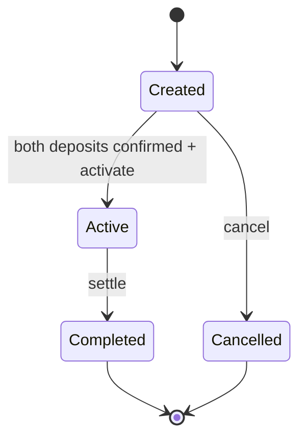

# VEIL Escrow V1 Smart Contract

`VeilEscrow` is a VEIL smart contract for buyer/seller workflow state. It is part of VEIL's application layer. It is not a Privacy Pool replacement and does not custody assets.

## Purpose

The contract records an escrow workflow linked to a VEIL channel:

- buyer and seller addresses,
- asset and payment references,
- deposit confirmation flags,
- current escrow status,
- lifecycle timestamps/events.

The references are generic felts. The current contract does not enforce token balances or Privacy Pool note state.

## State Model

## Public Interface

| Function | Current behavior |
| --- | --- |
| `create_escrow` | Creates a new escrow. Caller is buyer. Seller and references must be non-zero. |
| `confirm_buyer_deposit` | Buyer-only flag update while escrow is still in cancellable state. |
| `confirm_seller_deposit` | Seller-only flag update while escrow is still in cancellable state. |
| `activate` | Buyer or seller can activate after both deposits are confirmed. |
| `settle` | Buyer or seller can complete an active escrow. |
| `cancel` | Buyer or seller can cancel while the escrow is still cancellable. |
| `get_escrow` | Reads the full escrow struct. |
| `get_status` | Reads status only. |
| `get_escrow_count` | Reads total created escrows. |

## Events

- `EscrowCreated`
- `BuyerDepositConfirmed`
- `SellerDepositConfirmed`
- `EscrowActivated`
- `EscrowSettled`
- `EscrowCancelled`

## Implemented Protections

- Participant access checks.
- Buyer-only and seller-only deposit confirmations.
- Non-zero address/reference assertions.
- Status transition validation.
- Reentrancy guard around state-changing functions.

## Not Implemented

- ERC20 custody.
- STRK20 note creation.
- Privacy Pool proof validation.
- Automatic token release.
- Settlement adapter implementation.

## Future Extension Point

`ISettlementAdapter` exists as an interface for future settlement logic. The current codebase does not include a deployed adapter implementation.
