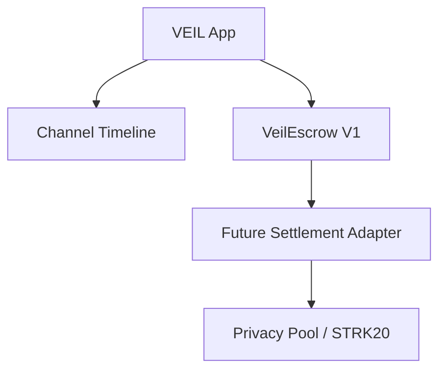
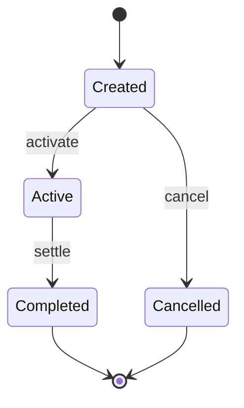

# VEIL Escrow V1

## Project Overview

VEIL Escrow V1 is a protocol-agnostic settlement coordinator for private negotiation channels. It does not custody tokens, does not implement Privacy Pool internals, and does not assume ERC20 or STRK20 transfer semantics.

The contract stores settlement references:

- `asset_type`
- `asset_reference`
- `payment_reference`

For testnet V1 these are plain felt references. Later, the same fields can point to a Privacy Pool note, a STRK20 asset reference, or another settlement adapter output without changing the core escrow state machine.

## Architecture Diagram



Current V1 uses only `VeilEscrow`. The adapter boundary exists as `ISettlementAdapter`, but no adapter is wired into the escrow state machine yet.

The deployed contract embeds OpenZeppelin Cairo:

- `ReentrancyGuardComponent`
- `SRC5Component`

## State Machine Diagram



No extra states are used.

## Storage Layout

`Escrow`:

- `escrow_id: felt252`
- `channel_id: felt252`
- `buyer: ContractAddress`
- `seller: ContractAddress`
- `asset_type: felt252`
- `asset_reference: felt252`
- `payment_reference: felt252`
- `buyer_deposited: bool`
- `seller_deposited: bool`
- `status: EscrowStatus`
- `created_at: u64`

Contract storage:

- `src5: SRC5Component::Storage`
- `reentrancy_guard: ReentrancyGuardComponent::Storage`
- `escrows: Map<felt252, Escrow>`
- `escrow_exists: Map<felt252, bool>`
- `escrow_count: u64`

## Event Flow

The frontend can reconstruct a channel timeline from events:

1. `EscrowCreated`
2. `BuyerDepositConfirmed`
3. `SellerDepositConfirmed`
4. `EscrowActivated`
5. `EscrowSettled`
6. `EscrowCancelled`

Each event includes:

- `escrow_id`
- `channel_id`
- `timestamp`

`EscrowCreated` also includes buyer, seller, and reference fields.

## Security Assumptions

V1 is a settlement workflow contract, not a custody contract.

It prevents:

- double buyer deposit confirmation
- double seller deposit confirmation
- settlement before activation
- cancellation after activation
- unauthorized caller actions
- invalid escrow IDs
- zero seller or buyer addresses
- invalid state transitions
- reentrant entry into state-changing functions

It does not:

- transfer STRK or ERC20 tokens
- create Privacy Pool notes
- spend nullifiers
- verify privacy proofs
- derive channel keys
- decrypt payloads

## Future Privacy Pool Integration Plan

The core escrow must stay protocol-agnostic. Privacy Pool and STRK20 support should be added through settlement adapters:

- `PublicSettlementAdapter`
- `PrivacyPoolSettlementAdapter`

Only adapters may interact with:

- notes
- nullifiers
- encrypted channels
- viewing keys
- InvokeExternal
- STRK20-specific references

The escrow contract should continue to store references and enforce workflow state.

## Deployment Guide

Build contracts:

```bash
scarb build
```

Run tests:

```bash
scarb test
```

Deploy `VeilEscrow` to Starknet Sepolia with the same flow used for other Cairo contracts in this repo.

Suggested testnet demo flow:

1. Buyer wallet calls `create_escrow`.
2. Buyer calls `confirm_buyer_deposit`.
3. Seller calls `confirm_seller_deposit`.
4. Buyer or seller calls `activate`.
5. Buyer or seller calls `settle`.
6. Frontend reconstructs the timeline from emitted events.

## Testing Guide

Snforge tests cover:

1. create escrow
2. buyer deposit
3. seller deposit
4. activate escrow
5. settle escrow
6. cancel escrow
7. reject double buyer deposit
8. reject double seller deposit
9. reject settlement before activation
10. reject cancellation after activation
11. reject unauthorized caller
12. reject invalid state transition
13. reject zero address
14. reject invalid escrow id

## VEIL IMPLEMENTATION NOTE

VEIL is being built before official Privacy Pool SDK access.

Design all interfaces so that future integration with:

- Privacy Pool
- STRK20
- InvokeExternal

can be added without modifying core escrow logic.

Core escrow must remain protocol-agnostic.
